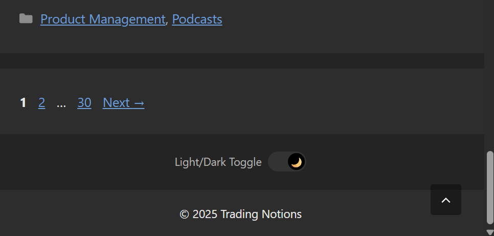
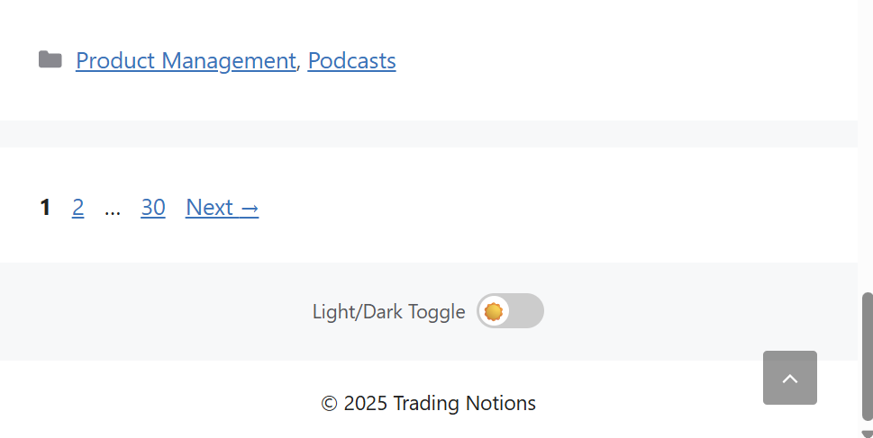

# GeneratePress Theme Dark/Light Mode Toggle

A simple dark/light mode toggle for the [GeneratePress WordPress theme](https://wordpress.org/themes/generatepress/). This solution adds a centered toggle switch in your footer that persists user preferences across page loads.

**🔗 [See it live on TradingNotions.com](https://tradingnotions.com)**

## Features

- ✨ Clean toggle with sun/moon icons
- 🎨 Respects user's system color scheme preference
- 💾 Saves preference to localStorage
- 📱 Responsive design
- ⚡ Lightweight

## Screenshots

### Dark Mode


### Light Mode


## Installation

This solution requires **GeneratePress theme** and the **GP Premium** add-on (for the Elements module).

### Step 1: WordPress, Add Custom CSS

1. In WordPress admin go to **Appearance → Customize → Additional CSS**
2. Copy and paste the contents of [`additional-css.css`](additional-css.css)
3. Click **Publish**

### Step 2: WordPress, Create Elements Hooks

In WordPress admin go to **Appearance → Elements** and create 3 new elements:

#### Hook 1: `wp_head`
- **Element Type:** Hook
- **Title:** wp_head
- **Hook:** `wp_head`
- **Content:** Copy from [`hook-wp_head.js`](hook-wp_head.js)
- **Execute PHP:** ✅ Check this box
- **Display Rules:** Entire Site

#### Hook 2: `wp_footer`
- **Element Type:** Hook
- **Title:** wp_footer
- **Hook:** `wp_footer`
- **Content:** Copy from [`hook-wp_footer.js`](hook-wp_footer.js)
- **Execute PHP:** ✅ Check this box
- **Display Rules:** Entire Site

#### Hook 3: `generate_before_footer_content`
- **Element Type:** Hook
- **Title:** generate_before_footer_content
- **Hook:** `generate_before_footer_content`
- **Content:** Copy from [`hook-generate_before_footer.html`](hook-generate_before_footer.html)
- **Execute PHP:** ✅ Check this box
- **Display Rules:** Entire Site

### Step 3: Test

1. Visit your site
2. Look for the toggle above your footer (below the copyright text)
3. Click to switch between light and dark modes
4. Refresh the page - your preference should persist

## Customization

### Change Toggle Position

Edit the `.footer-toggle-wrapper` class in `additional-css.css`:

```css
.footer-toggle-wrapper {
  text-align: center;      /* left, center, or right */
  margin-top: 0rem;        /* Adjust top spacing */
  margin-bottom: 1.5rem;   /* Adjust bottom spacing */
}
```

### Change Label Text

Edit `hook-generate_before_footer.html`:

```html
<span class="toggle-label">Light/Dark Toggle</span>
```

### Customize Dark Mode Colors

Edit the `html[data-scheme="dark"]` section in `additional-css.css`:

```css
html[data-scheme="dark"] {
  --contrast: #e8e8e8;   /* Text color */
  --contrast-2: #b4b4b4; /* Secondary text */
  --base: #1a1a1a;       /* Background */
  --base-2: #242424;     /* Secondary background */
  --accent: #5b9dd9;     /* Links/accents */
}
```

### Change Icons

Replace the emoji icons in `additional-css.css`:

```css
.slider::before {
  content: "☀️";  /* Light mode icon */
}

.toggle input:checked + .slider::before {
  content: "🌙";  /* Dark mode icon */
}
```

## How It Works

1. **`hook-wp_head.js`** - Runs before page render to prevent flash of unstyled content
2. **`hook-wp_footer.js`** - Initializes the toggle and handles user interactions
3. **`hook-generate_before_footer.html`** - Renders the toggle HTML in the footer
4. **`additional-css.css`** - Provides all styling and dark mode color schemes

## License

MIT License - Feel free to use this in your projects!

## Credits

Created for GeneratePress theme users who want a simple, lightweight dark mode solution.

---

If you find this useful, consider starring the repo ⭐
